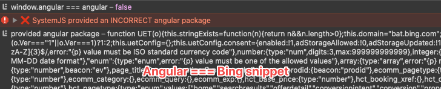
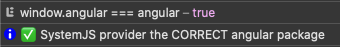

# SystemJS Import race condition on Safari

This repository reproduces a bug when importing SystemJS modules.
In only happens on Safari
See https://github.com/systemjs/systemjs/issues/2323

From what I've found, we have a conflict with Bing analytics snippet.

# Build

```sh
yarn # or npm install
yarn build
npx serve .
```

Open safari on http://localhost:5000
- The first time it will work
- Refresh and it will fail

# Details
It seems System JS and Bing conflict when they load external scripts:
- SystemJS load `angular` script and inserts a `<script>` tag
- Bing snippet creates a `<script>` tag to load `bat.js`
- SystemJS gets the last inserted script and believe it will be `angular` code
- Once Bing `bat.js` script has been loaded, SystemJS will provide the content of `bat.js` as `angular` module 🤯
- The result of the import is logged in the console for debugging purpose

# Actual behaviour
Check the console, you will see `angular` module provided by SystemJS is actually the content of `bat.js`.


# Expected Behaviour
In `src/entry.js`, you can update the variable `const loadBing = false;` to disable the conflicting script
Make sure to rerun `yarn build`.

Check the console, you will see `angular` module provided by SystemJS is correct.


